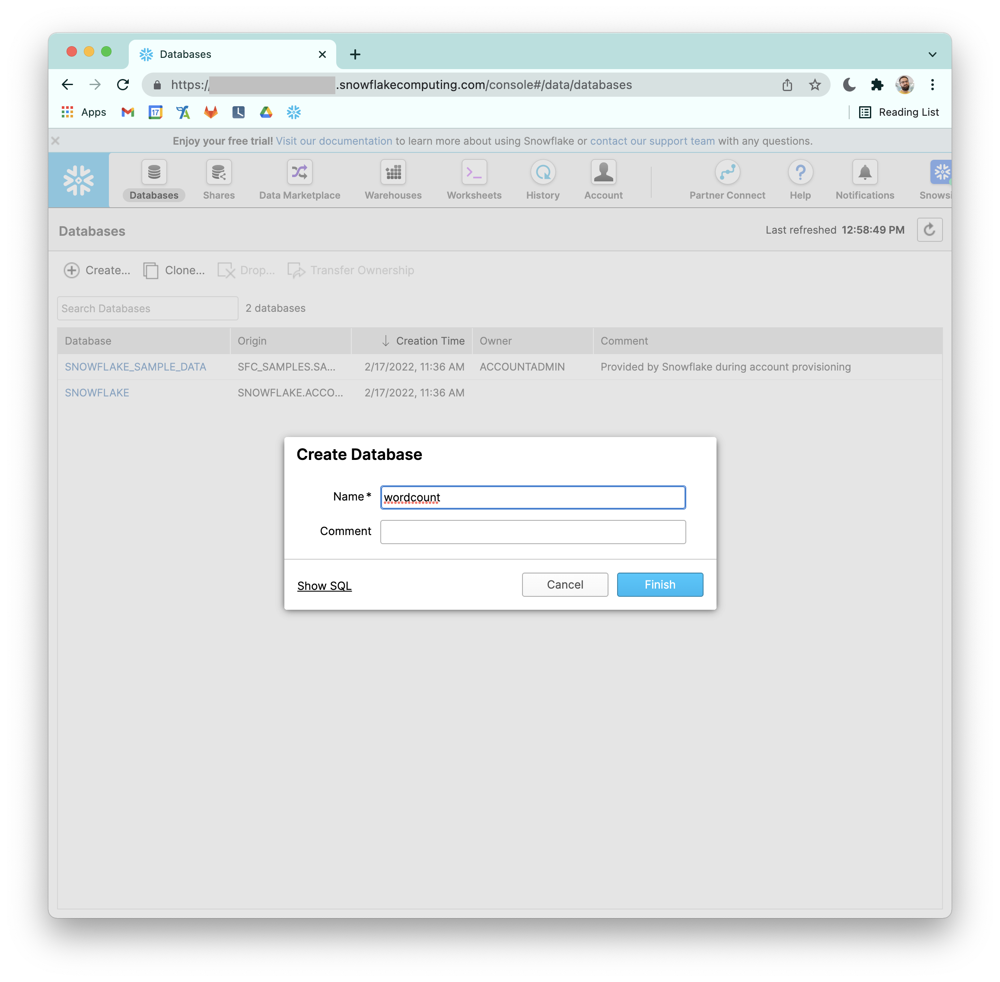
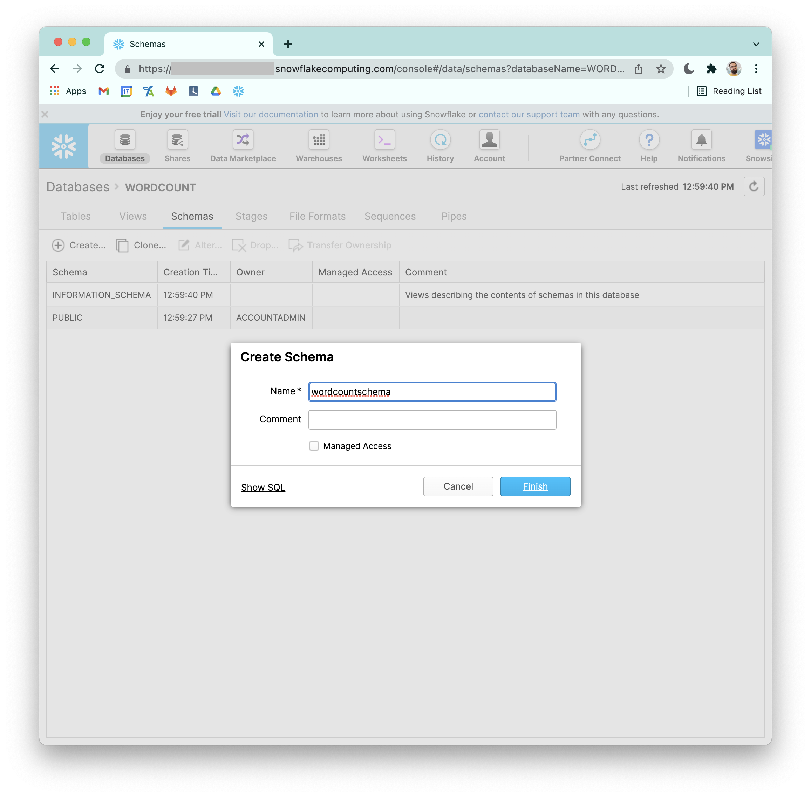
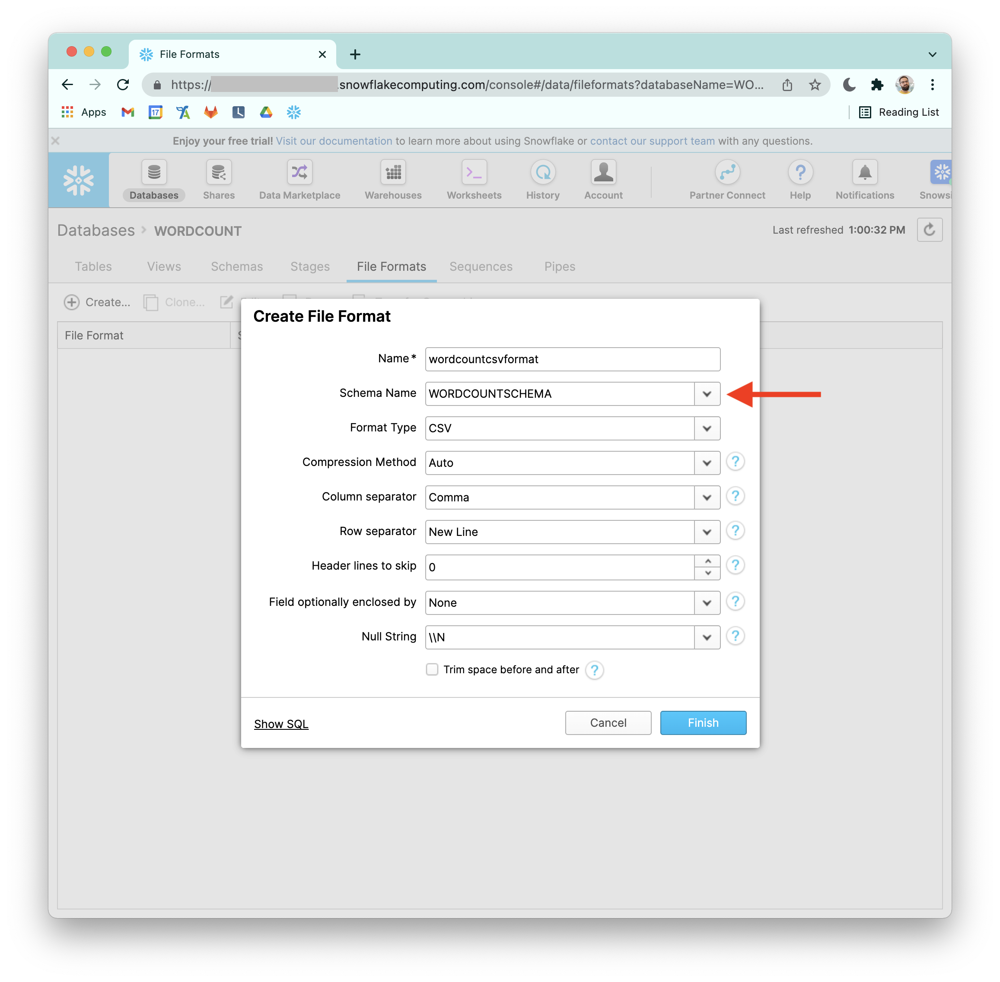

# Install Snowflake


Create account 

## Create db



## Create schema



## Create file format



## Set environment variables

```bash
export SNOW_ACCOUNTNAME=<YOUR_SNOWFLAKE_ACCOUNTNAME>
export SNOW_USERNAME=<YOUR_SNOWFLAKE_USERNAME>
export SNOW_PWD=<YOUR_SNOWFLAKE_PWD>
export SNOW_REGION=<YOUR_SNOWFLAKE_REGION>
export SNOW_DBNAME=<YOUR_SNOWFLAKE_DBNAME>
export SNOW_SCHEMANAME=<YOUR_SNOWFLAKE_SCHEMANAME>
export SNOW_WAREHOUSENAME=<YOUR_SNOWFLAKE_WAREHOUSENAME>
```

---

## Install Snowflake client

```
cd ~
curl -O https://sfc-repo.snowflakecomputing.com/snowsql/bootstrap/1.2/linux_x86_64/snowsql-1.2.21-linux_x86_64.bash
bash snowsql-1.2.21-linux_x86_64.bash 
```

## Configure client

```bash
mkdir -p ~/.snowsql

echo "[connections]
accountname = ${SNOW_ACCOUNTNAME}
username = ${SNOW_USERNAME}
password = ${SNOW_PWD}
region = ${SNOW_REGION}
dbname = ${SNOW_DBNAME}
schemaname = ${SNOW_SCHEMANAME}
warehousename = ${SNOW_WAREHOUSENAME}

[variables]

[options]
auto_completion = True
log_file = ~/snowsql_rt.log
log_level = DEBUG
timing = True
output_format = psql
key_bindings = vi
repository_base_url = https://sfc-repo.snowflakecomputing.com/snowsql" > ~/.snowsql/config

chmod 700 ~/.snowsql/config
```

## Optional: Test SnowfSQL installation

```bash
/home/ubuntu/bin/snowsql --version
```