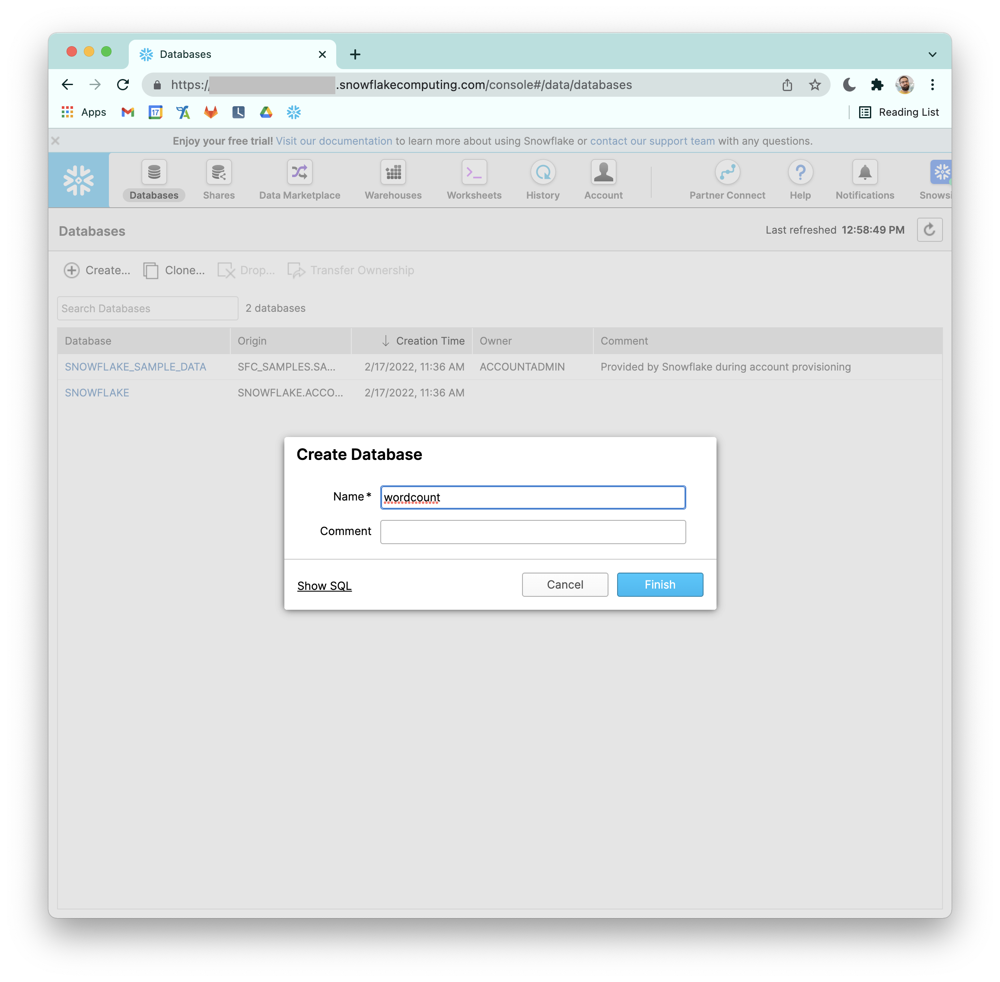
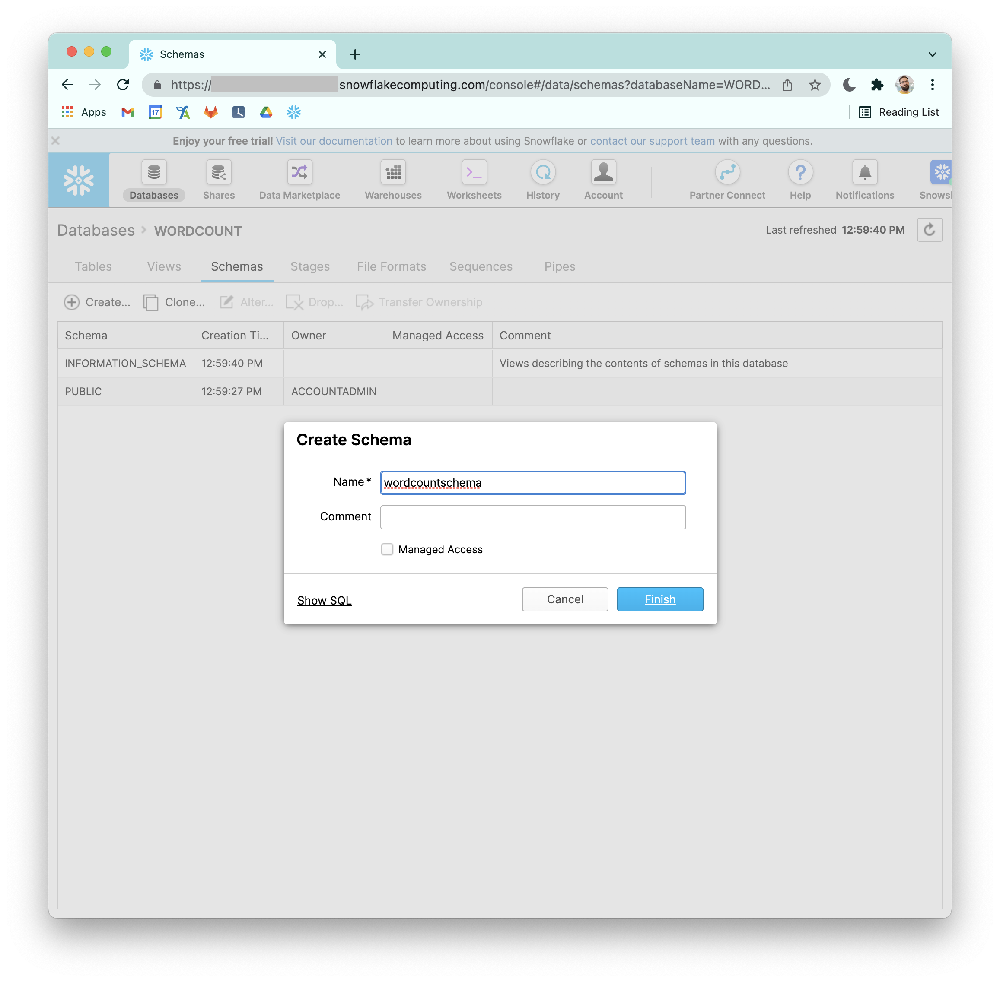
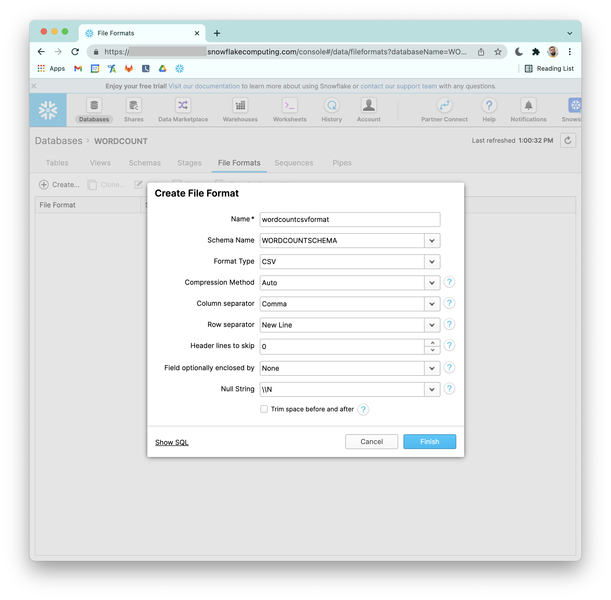
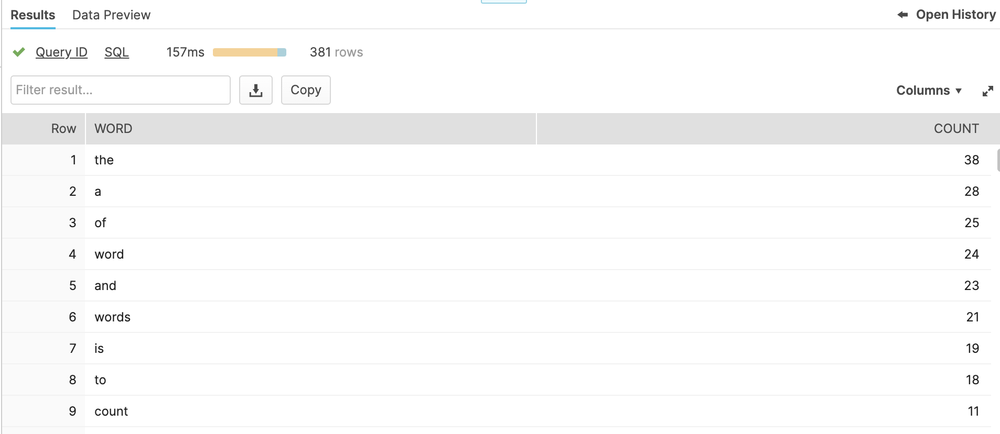

# Snowflake Word Count

## Prerequisite

### Create db



### Create schema



### Create file format



### Load wordcount.txt

Follow the procedure from the official docs: https://docs.snowflake.com/en/user-guide/data-load-web-ui.html#step-1-opening-the-load-data-wizard


## Run query

```sql
SELECT word, COUNT(*) as count
from (
  select c.value::string as word 
  from "WORDCOUNT"."WORDCOUNTSCHEMA"."TEST2", 
        lateral flatten(input=>split(C1, ' ')) c
)
group by word
order by count desc;
```

Expected result:


