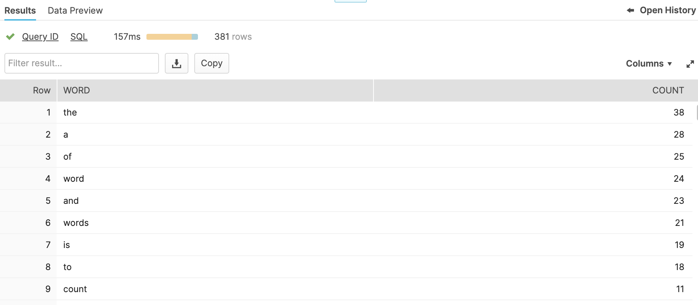

# Snowflake Word Count

### Load wordcount.txt

```bash
/home/ubuntu/bin/snowsql --query "PUT file://./data/wordcount.txt '@mystage';"

/home/ubuntu/bin/snowsql --query "COPY INTO WORDVALUE 
FROM '@mystage';"
```


## Run query

```bash
/home/ubuntu/bin/snowsql --query "SELECT word, COUNT(*) as count
from (
  select c.value::string as word 
  from "WORDCOUNT2"."NEWSCHEMA"."WORDVALUE", 
        lateral flatten(input=>split(C1, ' ')) c
)
group by word
order by count desc
limit 10;"
```

Expected result:

